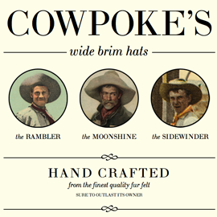
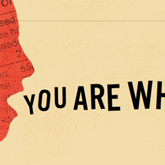

Have you ever dreamed of having down-to-the-letter control of type in CSS?

[Lettering.js](http://letteringjs.com/) is a sweet [jQuery](http://jquery.com/) plugin which allows you tweak the typography of your site. It allows you to target specific letters, words, or lines within a text element by automatically wrapping them in spans. You can then get creative in CSS and use selectors to drill down to the precise span and tweak to your heart's content. Here's some examples of what you can do with it:

I'm going to show you the ropes, we'll be using this HTML snippet throughout the examples:

    [@language="html"]
    [@caption="original.html"]
    <article>
      <h1>Lipsum</h1>
      
Lorem ipsum dolor sit amet, consectetur adipiscing elit.

      
Proin elementum erat id mi aliquam ac fermentum sem sollicitudin.

    </article>

## Character lettering

Sometimes you need to-the-letter control over a piece of text. Maybe you want to adjust the kerning of a heading, or colour each letter differently.

To apply character lettering, you call `lettering()` on a selector.

    [@language="javascript"]
    [@caption="character_lettering.js"]

    $(document).ready(function() {
      $("article > h1").lettering();
    });

The contents of the `h1` element will be split into characters:

    [@language="html"]
    [@caption="character_lettering.html"]
    <article>
      <h1>
        L
        i
        ...
        m
      </h1>
      ...
    </article>

## Word lettering

Now let's say you want apply word lettering to every paragraph. This time you specify the `words` parameter.

    [@language="javascript"]
    [@caption="word_lettering.js"]

    $(document).ready(function() {
      $("article > p").lettering("words");
    });

The contents of each `p` element will be split into words:

    [@language="html"]
    [@caption="word_lettering.html"]
    <article>
      <h1>Lipsum</h1>
      

        Lorem
        ipsum
        ...
        elit.
      

      

        Proin
        elementum
        ...
        sollicitudin.
      

    </article>

## XY crazy shit

You can use jQuery chaining to apply lettering multiple times. For example, let's say we want to apply word lettering to every paragraph and then apply character lettering to the first word in each paragraph:

    [@language="javascript"]
    [@caption="word_and_character_lettering.js"]

    $(document).ready(function() {
      $("article > p:first").lettering("words").children("span").first().lettering();
    });
